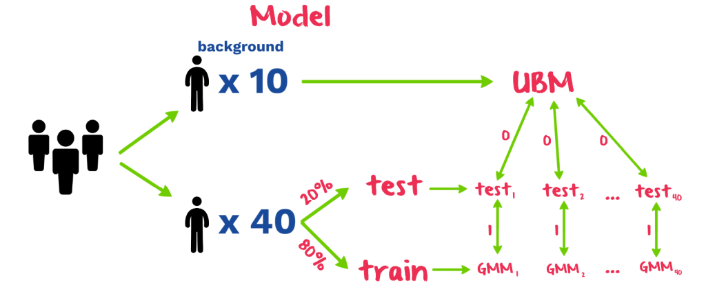

# gaitrec

## Accelerometer based gait recognition using Gaussian Mixture Models

### Goal

The objective of this project is to determine whether Gaussian Mixture models are appropriate for gait recognition using the [IDNet dataset](http://signet.dei.unipd.it/human-sensing/).

Semestrial project for Stochastic Search, Spring 2018.

### Dataset

Please consult the [IDNet readme](http://signet.dei.unipd.it/wp-content/uploads/2016/10/IDNET_README_Nov2016.txt).

### How it works

In principle, there are two ways for processing raw accelerometer data: cycle detection or (non-)overlapping frames. For the sake of simplicity, the data is split into non-overlapping frames of varying sizes from 128 records to 2048 records. The time intervals between accelerometer measurements are constant, thus there is no need for interpolation. 

After splitting the data into frames, feature extraction takes place (where applicable, for all axis):
- mean
- standard deviation
- absolute deviation
- magnitude
- zero crossing rate
- minimum
- maximum
- 10-bin histogram between -1.5g and 1.5g (g = 9.81 m/s^2)

Separate threads handle the processing of each frame using Python's multiprocessing library.

### Measurement protocol

10 subjects are selected from the dataset of 50 subjects who represent the Universal Background Model or UBM. The rest is split 80-20%, from which 80% will be used to train mixture models with user specific data and 20% will be used for evaluating the setup. The distance of test data is measured from the UBM and the user specific model to which it belongs and decide its affiliation.

### Results

#### Fast dataset processing

Processing time of the accelerometer data of roughly 200 MB is shown below for different frame sizes:

|Frame size |Time (s) |
|-----------|---------|
|128        |700      |
|256        |600      |
|512        |566      |
|1024       |510      |

#### Model

The performance of the model is measured with Area under the Curve (AUC) and Equal Error Rate (EER).

|Frame      |AUC       |EER      |
|-----------|----------|---------|
|128        |96.72%    |5.56%    |
|**256**    |**97.16%**|**4.53%**|
|512        |96.62%    |5.19%    |
|1024       |93.52%    |9.05%    |

As shown, the frame size of ~256 seems to be optimal for this GMM-based model.

### Sources

- [Muaaz M., Mayrhofer R., Accelerometer based Gait Recognition using Adapted Gaussian Mixture Models, MoMM '16, November 28-30, 2016](https://usmile.at/sites/default/files/publications/p288-muaaz.pdf)
- [Gadaleta M., Rossi M., IDNet: Smartphone-based gait recognition with convolutional neural networks, Pattern Recognition, vol. 75, pp. 25-37, February 2018](https://www.researchgate.net/profile/Michele_Rossi16/publication/303921735_IDNet_Smartphone-based_Gait_Recognition_with_Convolutional_Neural_Networks/links/5a552653a6fdcc30f86b9603/IDNet-Smartphone-based-Gait-Recognition-with-Convolutional-Neural-Networks.pdf?origin=publication_detail)
- [D. Reynolds, Gaussian Mixture Models notes](https://pdfs.semanticscholar.org/734b/07b53c23f74a3b004d7fe341ae4fce462fc6.pdf)
- [In Depth: Gaussian Mixture Models](https://jakevdp.github.io/PythonDataScienceHandbook/05.12-gaussian-mixtures.html)
